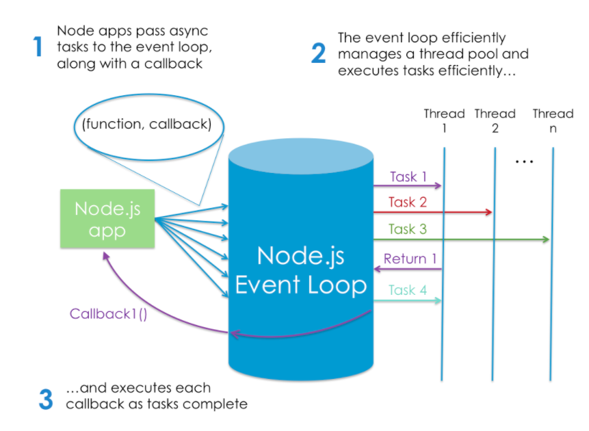

# Read: 06 - Node, Express, and APIs

Links: 
[An Introduction to Node.js on sitepoint.com](https://www.sitepoint.com/an-introduction-to-node-js)

- Node.js is a JavaScript runtime built on chrome's V8 JavaScript Engine
- Node.js is an event-based, non-blocking, asynchronous I/O runtime that uses Google’s V8 JavaScript engine and libuv library.
- npm is the package manager and also the world's largest software registry
- add `/* jshint esversion: 6 */` to the top of js files to pass linting if using jshint

- `npm init -y` will create and auto-populate a package.json file
- `npm install lodash --save` - installs lodash package
- node modules shouldn't be checked into version control and can always be recreated using npm install

Purpose of Node.Js
- installing(npm) and running(Node) various build tools designed to automate the process of developing JS application
- runs JavaScript on the server

Node Execution Model

 
 

[Back to Table of Contents](README.md)